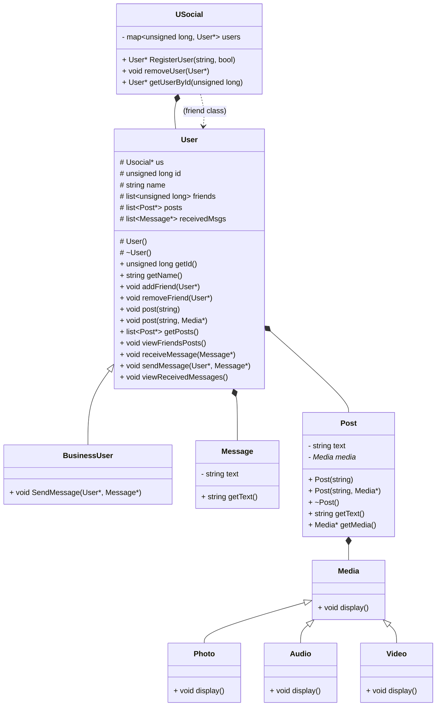

# Cpp-USocial
Basic framework for Social Network named USocial.\
Written and compiled in Visual Studio 2022 on Windows 11.

# Project Description
| Class Name | Class Description |
| --- | --- |
| USocial | Describes A Social Network |
| Media | Pure abstract class, Describes Media object |
| Photo | Inherits from Media, Represents Photo Object |
| Audio | Inherits from Media, Represents Audio Object |
| Video | Inherits from Media, Represents Video Object |
| Post | Represents a new Post, A Post must include text and only one Media object |
| User | Represents a User, User can send messages only to users in his friend list |
| Business User | Represents a Business User, Business User can send messages to anyone on the social network |
| Message | Represents A Message, A Message must include text |

# Project Architecture

